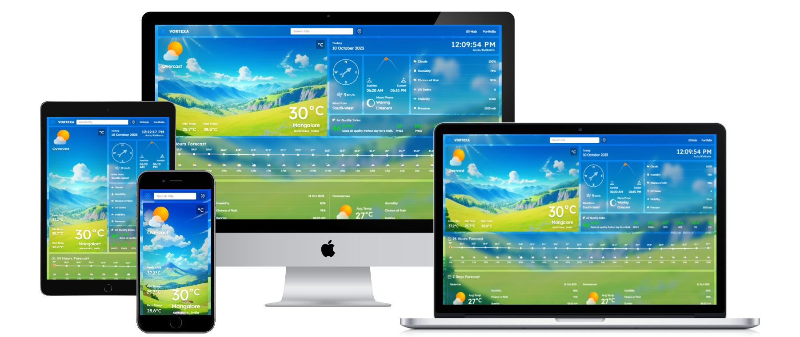

##### Created : 26/08/2023

# AWEATHI - Weather App
Explore comprehensive weather insights and forecasts with AWEATHI. Stay informed about current conditions, forecasts, and meteorological data, and gain valuable insights into weather patterns and trends.

### Live Demo

Check out a live demo of AWEATHI at https://AWEATHI.netlify.app/.

### Preview

## Tools and TechStacks used :

      
      
      
      
      
      
      

